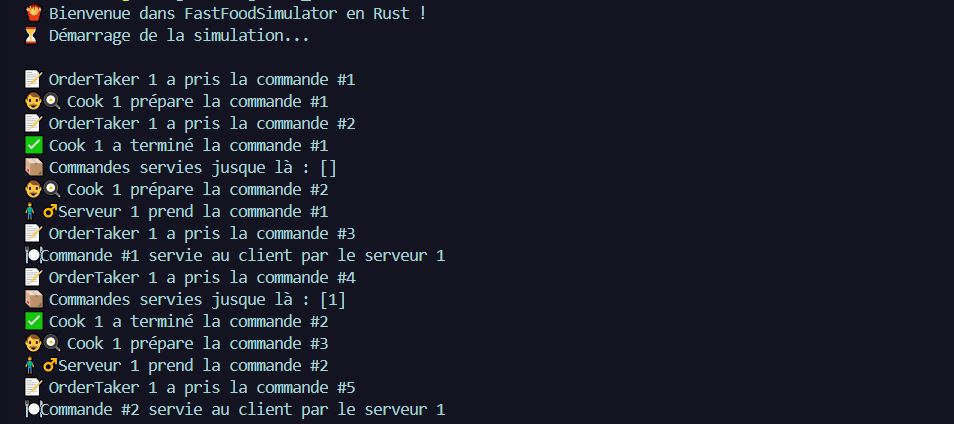

# 🍔 FastFoodSimulator (Rust Edition)

**FastFoodSimulator** is a minimalist console simulation of a fast-food restaurant, **rewritten in Rust**. The project models the basic operational flow: customer arrival, order taking, cooking, and serving — each step handled **asynchronously** and with **concurrency**.

> 🎯 This project allowed me to practice key Rust concepts such as `Arc`, `Mutex`, `tokio::sleep`, async task management, and clean modular structure.*
> > ⚠️ *Note: The app is currently in French due to its localized target audience.*

---

## ✨ Features

- ⏱️ Real-time simulation using `tokio::time`
- 🧱 Full workflow: `OrderTaker → Cook → Server`
- 🧵 Concurrency with `Arc<Mutex<>>`
- 📦 Modular, readable, and extensible codebase
- 🧠 Ideal structure to experiment with async logic in Rust

---

## 🧩 Architecture

| Component              | Role                                                       |
|------------------------|------------------------------------------------------------|
| `OrderTaker`           | Generates an order every X seconds                         |
| `Cook`                 | Prepares pending orders                                    |
| `Server`               | Delivers ready orders to customers                         |
| `Customer` (optional)  | Can be simulated to receive served orders                  |
| `Simulation`           | Starts and coordinates all tasks                           |
| `utils/timer.rs`       | Centralizes time-related constants                         |
| `models/order.rs`      | Defines the `Order` structure                              |

---

## 📸 Console Preview

> Example execution:



---

## 📦 Requirements

- Rust 1.70+
- Cargo
- VS Code or any Rust-compatible IDE

---

## 🚀 How to Run

```bash
git clone https://github.com/0xAdafang/FastFoodSimulator.git
cd FastFoodSimulator
cargo run
